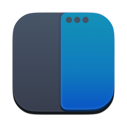
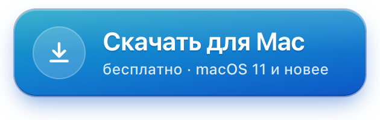
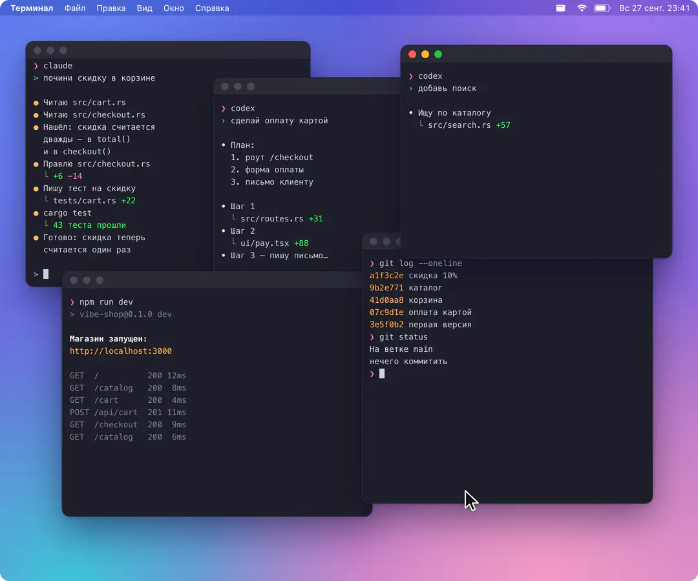
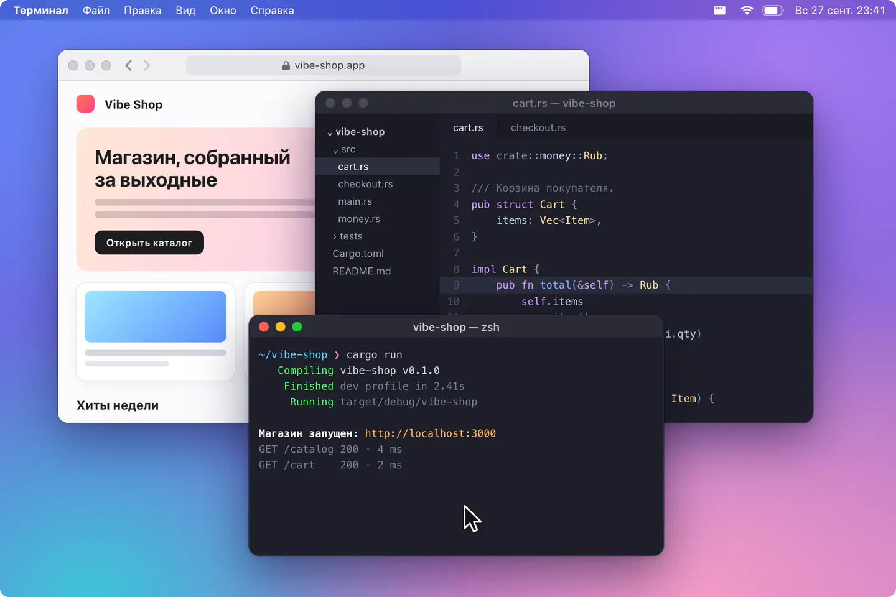
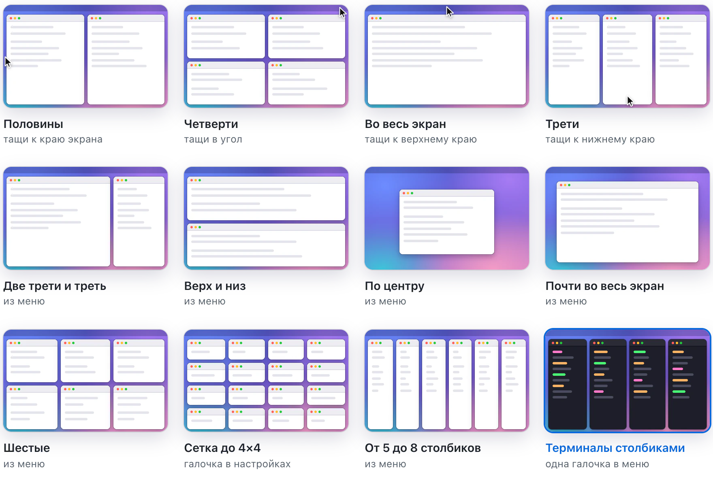
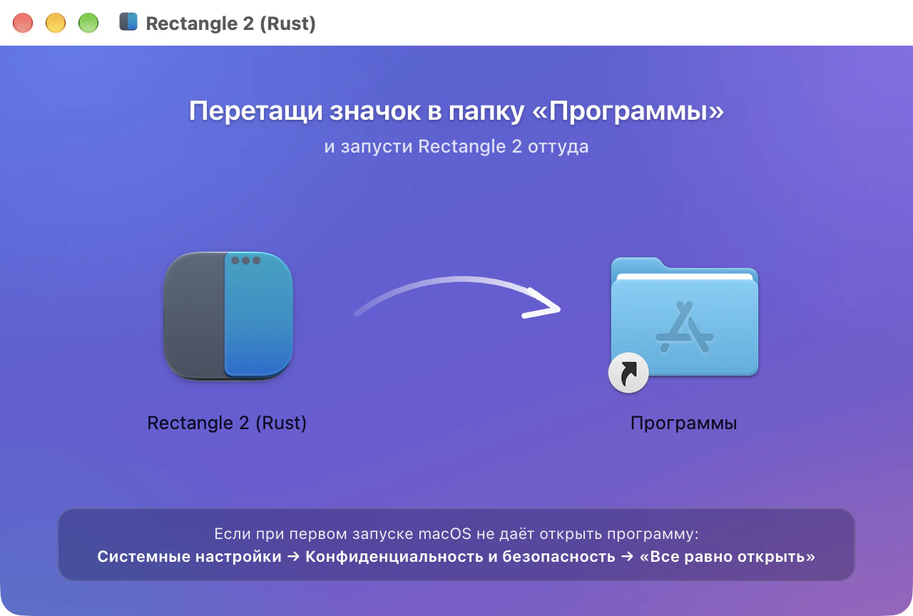

<p align="center">
  
</p>

<h1 align="center">Rectangle 2 (Rust)</h1>

<p align="center">
  <b>5, 6, 7, 8 терминалов на экране — ровными столбиками, без зазоров.</b><br>
  Открыл новое окно — все сами подвинулись. Закрыл — растянулись. Плюс раскладка окон мышью.
</p>

<p align="center">
  <a href="https://github.com/Lutamona/Rectangle2Rust/releases/latest/download/Rectangle2Rust.dmg"></a>
  <br>
  <sub>или <a href="#одной-командой">одной командой в Терминале</a> — так ещё проще</sub>
</p>

<p align="center">
  <a href="https://github.com/Lutamona/Rectangle2Rust/releases/latest"></a>
  
  
  <a href="LICENSE"></a>
</p>

<p align="center">
  
</p>

<p align="center">
  
</p>

## Зачем

Браузер, редактор, терминал, чат — окна наезжают друг на друга, нужное вечно где-то снизу. Чтобы поставить два окна рядом, приходится ловить уголки и тянуть руками.

С Rectangle 2 это одно движение: **дотащил окно до края — и оно встало ровно на своё место.**

- 🖥 **[Терминалы столбиками](#терминалы-столбиками).** 5–8 окон во всю высоту, без зазоров. Одна галочка — и строй держится сам: новое окно встаёт справа, после закрытого остальные растягиваются.
- 🎯 **Только мышь.** К краю — половина, в угол — четверть, наверх — весь экран, вниз — треть. Запоминать нечего.
- 🧩 **Десятки раскладок в меню.** Трети, шестые, сетки, от 5 до 8 столбиков, по центру, на соседний экран.
- 🪶 **Лёгкий.** 4 МБ, живёт в строке меню, в Доке не маячит, в интернет не ходит.
- 🇷🇺 **Бесплатно и на русском.** Без рекламы, подписок и регистрации. Открытый код.

Своя раскладка окон появилась в macOS только в 15-й версии, и третей, шестых, сеток и столбиков в ней нет.

## Терминалы столбиками

Claude Code, Codex, `npm run dev`, git — терминалов всегда больше, чем места на экране. Открой меню Rectangle 2 и поставь галочку **«Держать окна «Терминал» столбиками»**: все окна встанут ровными столбиками во всю высоту экрана, впритык, без зазоров, и дальше будут держать строй сами. Открыл новое — оно встало справа, остальные подвинулись. Закрыл — оставшиеся растянулись. Пять, шесть, семь, восемь окон — неважно. А любое окно можно поставить на своё место из меню, например **«Четверти ▸ Последняя четверть»**.

Работает с любым приложением: галочка ставится для того, что сейчас впереди, и в меню подписано, для какого. А пункт **«Окна приложения столбиками»** расставит окна разово.

## Все раскладки

<picture>
  <source media="(prefers-color-scheme: dark)" srcset=".github/media/layouts-dark.webp">
  
</picture>

## Установка

Нужна macOS 11 или новее, подойдёт любой Mac — на Apple Silicon или Intel.

### Одной командой

Проще всего. Открой **Терминал** (⌘ + пробел, набери «Терминал», Enter), вставь строку и нажми Enter:

```sh
curl -fsSL https://raw.githubusercontent.com/Lutamona/Rectangle2Rust/main/install.sh | bash
```

Скрипт скачает свежую версию, положит её в «Программы» и запустит. Предупреждений про «непроверенного разработчика» не будет. Обновляться — той же командой, настройки сохранятся.

### Через .dmg

1. **[Скачай Rectangle2Rust.dmg](https://github.com/Lutamona/Rectangle2Rust/releases/latest/download/Rectangle2Rust.dmg)** и открой его.
2. Перетащи значок в папку «Программы».

   

3. Запусти Rectangle 2 из «Программ». В первый раз macOS ответит, что **файл «Rectangle 2 (Rust)» не был открыт**: так она встречает любую программу, автор которой не платит Apple за сертификат. Нажми **«Готово»**, открой **Системные настройки → Конфиденциальность и безопасность**, пролистай вниз и нажми **«Все равно открыть»**. Это нужно один раз.

### Последний шаг: доступ к окнам

При первом запуске Rectangle 2 попросит доступ к управлению окнами — без него macOS никакой программе не даёт двигать чужие окна. Нажми **«Открыть Системные настройки»** и включи переключатель **«Rectangle 2 (Rust)»** в разделе **Универсальный доступ**.

Готово: значок появился в строке меню справа вверху. Тащи окна!

> [!TIP]
> Загляни в меню → **«Настройки…»**. Включи **«Запуск при входе в систему»**, чтобы Rectangle 2 стартовал вместе с Mac, а в **«Промежутках между окнами»** добавь немного воздуха, если окнам тесно.

## Как пользоваться

| Что сделать | Что будет |
|:---|:---|
| Тащишь окно за заголовок **к левому или правому краю** | половина экрана |
| Тащишь **в угол** | четверть |
| Тащишь **к верхнему краю** | весь экран |
| Тащишь **к нижнему краю** | треть; веди вдоль края, чтобы выбрать какую |
| Оттаскиваешь окно от края | оно возвращает прежний размер |
| **Двойной клик** по заголовку окна | развернуть или вернуть (настраивается) |
| Кликаешь по **значку в строке меню** | все раскладки: трети, четверти, шестые, столбики, по центру, соседний экран… |

Сетки 3×3 и 4×4, восьмые и двенадцатые появятся в меню, если в настройках включить **«Показывать дополнительные размеры в меню»**.

## Частые вопросы

<details>
<summary><b>macOS пишет, что приложение повреждено</b></summary>
<br>

Так бывает, если скачать архив браузером: macOS помечает его как файл из интернета и иногда перестраховывается. Выполни в Терминале и запусти снова:

```sh
xattr -dr com.apple.quarantine "/Applications/Rectangle 2 (Rust).app"
```

Или поставь [одной командой](#одной-командой): у скачанного через `curl` такой пометки нет.
</details>

<details>
<summary><b>Окна не двигаются</b></summary>
<br>

Проверь доступ: **Системные настройки → Конфиденциальность и безопасность → Универсальный доступ**, переключатель у «Rectangle 2 (Rust)» должен быть включён.

Если обновлялся вручную, через .dmg, старое разрешение могло перестать действовать, хотя переключатель горит. Выдели строку, удали её кнопкой **«−»** и запусти Rectangle 2 заново: он попросит доступ ещё раз. Или то же одной командой:

```sh
tccutil reset Accessibility local.rectangle2rust
```

Команда установки делает это сама.
</details>

<details>
<summary><b>Мешает встроенной раскладке macOS 15</b></summary>
<br>

Обе ловят одно и то же перетаскивание к краю. Rectangle 2 сам предупредит об этом и предложит выключить системную раскладку.
</details>

<details>
<summary><b>Как обновиться?</b></summary>
<br>

Той же [командой установки](#одной-командой) или свежим .dmg со [страницы релизов](https://github.com/Lutamona/Rectangle2Rust/releases/latest). Из меню туда ведёт **«Проверить обновления…» → «Открыть страницу релизов»**. Настройки сохранятся.
</details>

<details>
<summary><b>Как удалить?</b></summary>
<br>

Меню → **«Выход из Rectangle 2 (Rust)»**, потом перетащи приложение из «Программ» в Корзину. Если хочешь стереть и настройки: `defaults delete local.rectangle2rust`.
</details>

<details>
<summary><b>Это безопасно?</b></summary>
<br>

Весь код открыт и лежит здесь. Программа не ходит в интернет и ничего никуда не отправляет, а доступ к окнам ей нужен, только чтобы их двигать. Не хочешь доверять готовой сборке — [собери сам](#для-программистов), это пара команд.
</details>

## Для программистов

Порт Swift-приложения [Rectangle](https://github.com/rxhanson/Rectangle) на Rust через [`objc2`](https://github.com/madsmtm/objc2): AppKit, Accessibility API, CGEvent tap. Геометрия раскладок сверялась с настоящим Swift-кодом Rectangle на сотнях тысяч случаев, и числа совпадают до бита. В проекте 435 тестов.

```sh
git clone https://github.com/Lutamona/Rectangle2Rust && cd Rectangle2Rust
cargo test --release
./build.sh              # → dist/Rectangle2Rust.app
./build.sh --install    # то же и установка в /Applications
./build.sh --universal  # Apple Silicon + Intel (rustup target add x86_64-apple-darwin)
./build.sh --dev        # отдельная тестовая копия со своими настройками
packaging/release.sh    # файлы релиза: dist/Rectangle2Rust.zip и .dmg
```

Нужен Rust (stable) и Xcode Command Line Tools, для .dmg ещё `pip install dmgbuild`. Если в связке ключей есть сертификат Apple Development, `build.sh` подпишет им, и доступ не будет слетать после пересборки. Иначе будет ad-hoc подпись. `release.sh` всегда подписывает ad-hoc, чтобы личный сертификат не попал в публичную сборку.

<details>
<summary>URL-схема (для Raycast, Alfred, скриптов)</summary>
<br>

```sh
open "rectangle2rust://execute-action?name=left-half"
open "rectangle2rust://execute-action?name=column-five1"
open "rectangle2rust://execute-task?name=ignore-app"
open "rectangle2rust://execute-task?name=unignore-app&app-bundle-id=com.apple.Terminal"
```

Имена действий как у Rectangle, в kebab-case (`leftHalf` → `left-half`). Горячие клавиши можно назначить через эти ссылки в любом лаунчере.
</details>

<details>
<summary>Чем отличается от оригинального Rectangle</summary>
<br>

- Нет горячих клавиш: управление только мышью и меню (или через URL-схему).
- Интерфейс только на русском.
- Действия, у которых в оригинале был только шорткат, собраны в подменю «Другое».
- Добавлены «Окна приложения столбиками», «Держать окна … столбиками» и столбики 5–8.
- Нет автообновления: «Проверить обновления…» ведёт на страницу релизов.
- Запуск при входе работает с macOS 13.
- Настройки хранятся в `UserDefaults` домена `local.rectangle2rust` под теми же ключами, что у оригинала. Все ключи описаны в [docs/settings.md](docs/settings.md).
</details>

## Благодарности и лицензия

Всё сделано на основе [Rectangle](https://github.com/rxhanson/Rectangle) Райана Хэнсона. Если нужны горячие клавиши и английский интерфейс, бери оригинал, он отличный.

Это неофициальный порт, с авторами Rectangle он не связан. Лицензия [MIT](LICENSE).
